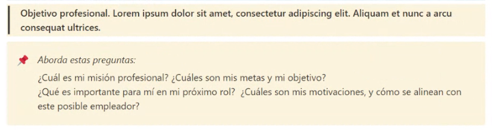
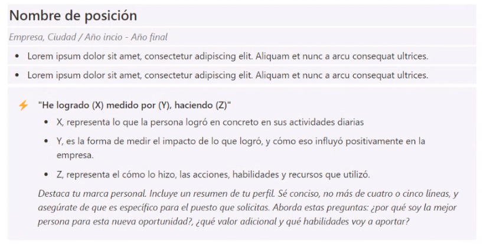
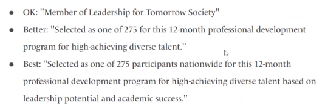
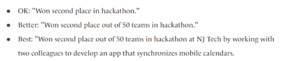

# Marianna Cruz Teixeira

### Software Engineer

#### Mid-level | +8 years of experience

```
Mission statement etiam dapibus convallis nisl. Donec sodales tempus libero sit amet congue. Vestibulum non dapibus elit. Ut suscipit ullamcorper aliquet. Integer id tortor in eros efficitur ullamcorper. Morbi in tortor odio.
```



```
  Things I enjoy working with
```

## Skills

`Hard/Soft skill | My Level`

|                |        |
| -------------- | ------ |
| **Portuguese** | Native |
| **English**    | Fluent |

|                |          |
| -------------- | -------- |
| **NodeJS**     | My Level |
| **Typescript** | My Level |
| **GIT**        | My Level |
| **Agile**      | My Level |

|                                                                   |
| ----------------------------------------------------------------- |
| Good communication                                                |
| Aware of other parts of the process (Design, Testing, Validation) |

## Experiences

[XYZ Formula Article](https://www.inc.com/bill-murphy-jr/google-recruiters-say-these-5-resume-tips-including-x-y-z-formula-will-improve-your-odds-of-getting-hired-at-google.html)




### Software Engineer @ VTEX (mar/2021 - jun/2023)

`Typescript | NodeJS | .Net | GraphQL | AWS`

Etiam dapibus convallis nisl. Donec sodales tempus libero sit amet congue. Vestibulum non dapibus elit. Ut suscipit ullamcorper aliquet. Integer id tortor in eros efficitur ullamcorper. Morbi in tortor odio.

### Software Engineer @ Phoebus (jul/2019 - feb/2021)

`Javascript | React Native | Java | Kotlin | Gradle | AWS Lambda`

Sed eu egestas odio, a dapibus tellus. Aenean vel eros in odio imperdiet vestibulum quis quis magna. Aenean elementum volutpat justo vitae accumsan. Aenean quis elementum nisl, quis fermentum dui.

### Fullstack Web Developer/Researcher @ LAVID (jun/2018 - mar/2019)

`Javascript | NodeJS | HTML | CSS | MySQL`

### Fullstack Web Developer @ YuppieTech (apr/2016 - apr/2018)

`PHP | Zend Framework | HTML | CSS | Javascript | Customer Service`

### Back-end Developer Intern @ AcadeoneSoftwares (aug/2015 - dec/2015)

`PHP | Zend Framework | Javascript`

### Client support and full stack developer @ CCHLA/UFPB - Intern

`PHP | Wordpress | Drupal | HTML | CSS | Customer Service`

### Freelancer (jun/2013 - apr/2016 )

`PHP | Wordpress | Wordpres Plugins | HTML | CSS | Javascript`

## Education

### Software Enginer @ Digital Product School (sep/2018 - nov/2018)

Digital Product School is a 3-month training program which promotes a realistic enviroment for building digital products in a diverse and multidisciplinary team, aiming to solve real problems around mobility and transportation.

### Exchange Student @ IPB (feb/2015 - jun/2015)

One semester Bachelor of Multimedia, Programming and Entrepreneuship

### Student @ UFPB

Bachelor of Communication in Digital Media
